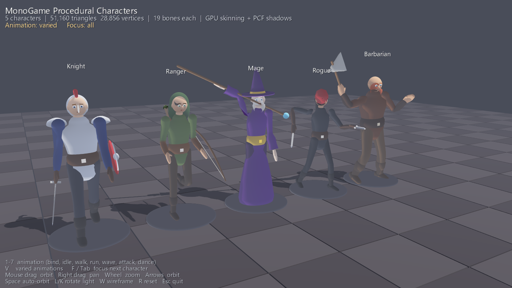
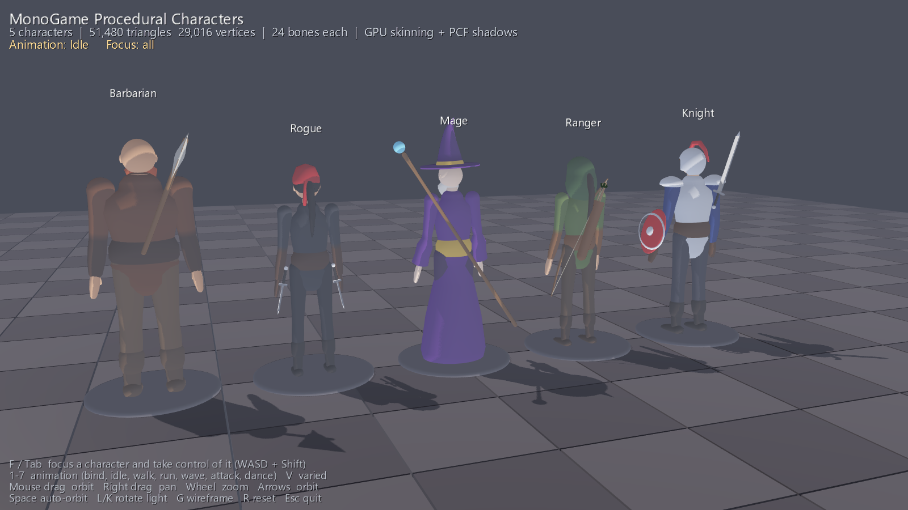
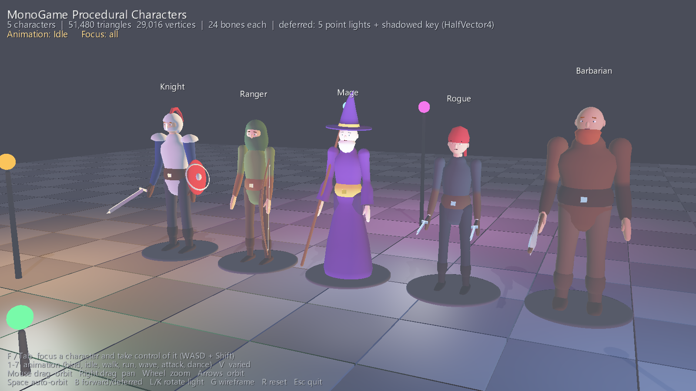
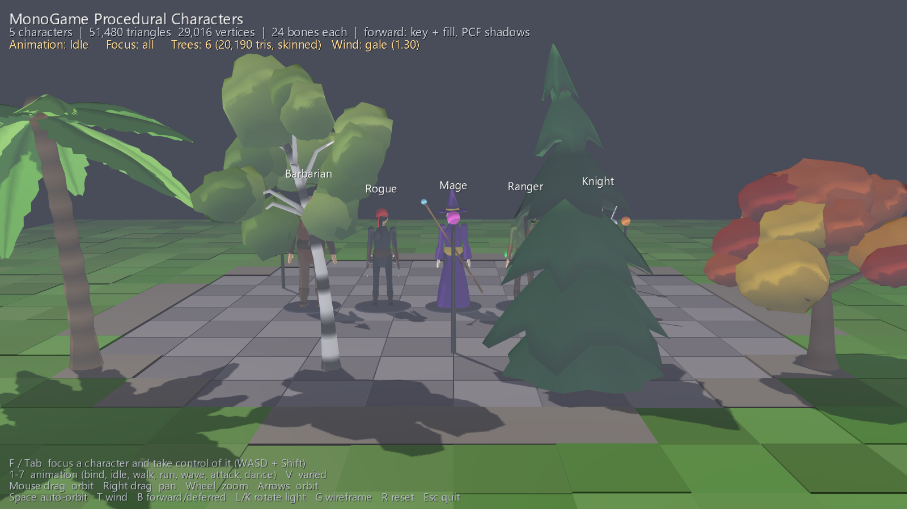
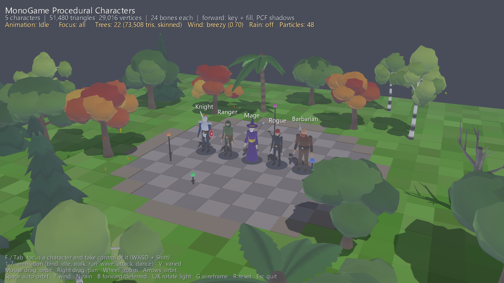
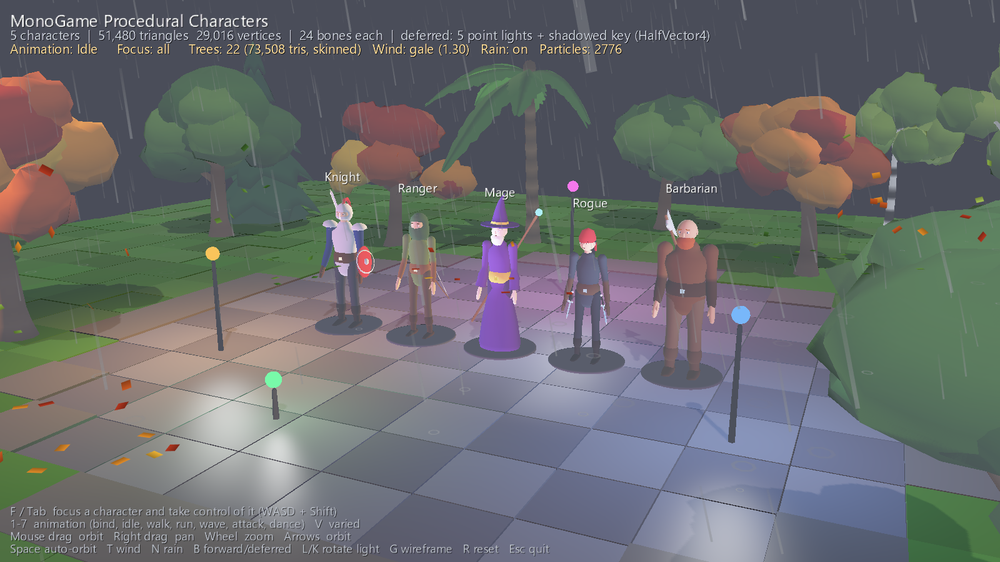

# CharacterModels — procedural 3D characters in MonoGame

Five fully rigged, skinned and animated 3D characters generated entirely in code —
no FBX, no textures, no external assets. Everything (skeleton, mesh, skin weights,
materials, animations, lighting shader) is built at startup by the C# code in this folder.








The plaza is ringed by **procedural trees** in six styles (oak, autumn maple, pine, birch, palm, dead) that
sway in the wind — each tree is a small skinned rig, so the same GPU skinning that moves the characters bends
the trunks and branches, while the vertex shader adds a high-frequency leaf flutter.

## Run

```
dotnet run
```

Requires the .NET SDK (9+) and the MonoGame 3.8.5 DesktopGL package (restored automatically).
The content pipeline compiles `Content/Character.fx` and the sprite font on first build.

### Controls

| Key | Action |
|---|---|
| `1`–`7` | Animation for everyone: bind pose, idle, walk, run, wave, attack, dance |
| `V` | "Varied" — each character plays a different clip |
| `F` / `Tab` | Focus the next character **and take control of it** (cycles back to the overview) |
| `W A S D` | Move the controlled character (camera-relative) · hold `Shift` to run |
| `H` | Draw / sheathe the weapon (reach to the back or hip sockets) |
| `Q` / `E` / `X` | Attack (auto-draws first) / wave / dance (cancelled by moving) |
| Mouse drag / arrows | Orbit camera · right-drag pans · wheel zooms |
| `Space` | Toggle auto-orbit turntable |
| `L` / `K` | Rotate the key light |
| `T` | Cycle wind: still → calm → breezy → gale |
| `N` | Toggle rain (streaks, ground splashes); leaves blow off the broadleaf trees whenever there is wind |
| `B` | Toggle deferred (many coloured point lights) / forward (MSAA) rendering |
| `G` | Wireframe |
| `R` | Reset camera |

### Command-line options

Useful for scripted screenshots and exports:

```
CharacterModels --no-orbit --yaw 35 --pitch 10 --dist 6 --varied --warm 1.0 --shot out.png
CharacterModels --export ./obj --shot tmp.png
```

`--yaw/--pitch/--dist` camera, `--focus n` character index, `--ty` focus height fraction,
`--clip n` animation, `--varied`, `--warm s` pre-advance the animations by *s* seconds,
`--light deg` key-light yaw, `--forward` start in forward mode, `--debug light|normal|albedo` show a G-buffer/light buffer, `--drawn` start with weapons in hand, `--draw s` trigger a draw at *s* seconds into the warm-up, `--shot file.png` render one frame offscreen (8× MSAA) and exit,
`--export dir` write every character's bind-pose mesh as a Wavefront OBJ (with vertex colours;
opens in Blender).
`--trees n` number of trees planted around the plaza (0 = none), `--seed n` planting/shape seed,
`--gallery` one tree of each style in a row behind the characters, `--wind s` wind strength (0 still … 1.3 gale),
`--rain [density]` start raining, `--walk [speed]` (with `--focus`) run the character into the nearest tree and print the resulting distance plus the head's lateral / fore-aft excursion (collision + wobble test).

## How it works

| File | Role |
|---|---|
| `Skeleton.cs` | Bone hierarchy. Bind pose is axis-aligned; `Update()` produces the GPU palette (`InverseBind × World`). |
| `MeshBuilder.cs` | Procedural geometry: **lofts** (tubes through elliptical rings with parallel-transport frames and hemispherical caps), shaped **ellipsoids** (per-direction radius function — used for skulls, jaws, hair, hoods, helmets), and flat-shaded **boxes**. Smooth area-weighted normals per part. |
| `Weighter` (in `MeshBuilder.cs`) | Automatic skin weighting: each vertex is weighted by inverse-power distance to the bone segments of the part's allowed bones, top 4 kept and normalised. This gives smooth elbows/knees/shoulders without hand-painting. |
| `Character.cs` | `CharacterSpec` (proportions, palette, gear flags) → `CharacterBuilder` builds the 24-bone rig (spine chain, clavicles, arms, legs, toes, weapon bones at each hand and sheath sockets on the chest/hips) and ~10k-triangle body: torso/robe, neck, shaped head with eyes/iris/pupil/brows/nose/mouth/ears, hair styles, beard, mitten hands with thumbs, legs, boots, belt, pauldrons, quiver + arrows, shield, sword, daggers, axe, staff with orb, bow. `Roster` defines the five archetypes. |
| `Animation.cs` | `Pose` / `PoseWriter` hide the axis conventions ("swing this limb forward 30°", twist about the bone's own axis). `Clips` are procedural functions of time built from cyclic Catmull-Rom keyframes and C1-smooth curves: walk/run use `Gait` tables of hip/knee/ankle/toe angle over the stride (modelled on human gait data: heel strike, loading response, push-off, swing) plus pelvis drop/rotation, trunk counter-rotation and arm swing; the wave and the weapon draw/sheathe reach are solved with two-bone analytic arm IK (`PoseWriter.ArmIK`). `AnimationPlayer` cross-fades with slerp + smootherstep and then runs the arms, hands and head through a damped second-order spring, so they lag and settle (follow-through) instead of snapping. Player locomotion is a single speed-driven `Move` clip: idle, walk and run gaits are blended by speed on one continuously integrated stride phase (`Clips.StrideHz`), so there are no idle/walk/run cross-fades and the feet stay planted at every speed. |
| `DeferredRenderer.cs` + `Content/Deferred.fx` | Deferred path: the character effect writes a G-buffer through MRT (albedo+spec, world normal+shininess, depth), a half-float light buffer accumulates a shadowed directional pass plus additive sphere-volume point lights (lamp posts, and the mage's orb following its weapon bone), then a full-screen composite does rim, emissive, fog and tone mapping. `--debug albedo|normal|light` blits an intermediate buffer. |
| `Content/Character.fx` | HLSL (compiled to GLSL by MGCB): 4-bone GPU skinning, wrap-diffuse key light, hemisphere ambient, fill light, Blinn-Phong specular with Fresnel boost (per-vertex material = specular strength + shininess), rim light, 3×3 PCF shadow map, object-space procedural grain, fog, exposure tone-mapping + gamma. A second technique renders the shadow map. |
| `Trees.cs` | `TreeBuilder` grows a trunk chain of bones (4–6 segments, stiff at the base) with branch / frond bones hanging off it, then lofts bark tubes, shaped-ellipsoid leaf masses (lumpy radius function, darker underside baked into vertex colour), conical pine tiers and serrated palm fronds through `MeshBuilder.Parametric`. `Wind` is a direction, a strength and a gust envelope that travels along the wind so downwind trees react later; `Tree.Update` rotates every bone about the cross-wind axis by `strength × gust × flex × oscillation`, with flex and frequency growing toward the tips. Foliage vertices carry a flutter weight in colour alpha that the vertex shader turns into a ripple along the normal. |
| `Weather.cs` | CPU particles drawn unlit through a `BasicEffect` after the lit scene: rain streaks stretched along velocity and faded into the fog, expanding splash rings where drops land, and leaves shed from tree crowns that tumble, flutter, drift with the gusts, settle and skitter in strong wind. |
| `Game1.cs` | Scene, circle push-out collision for the controlled character against tree trunks, lamp posts and other characters, orbit/follow camera, third-person control of the focused character (walk 1.6 m/s, run 4.4 m/s — tuned to the stride so feet do not slide), shadow pass (2048² R32F), floor, HUD and labels, startup options. |

### Making a new character

Add a `CharacterSpec` to `Roster.Create()`:

```csharp
new CharacterSpec
{
    Name = "Paladin", Height = 1.9f, Bulk = 1.1f, Shoulders = 1.15f,
    Shirt = new Color(230, 225, 210), Metal = new Color(235, 205, 120), Accent = new Color(40, 80, 160),
    HeadGear = HeadGear.Helmet, Weapon = Weapon.Sword, Sleeves = Sleeves.Long,
    Pauldrons = true, ChestPlate = true, Shield = true, Gloves = true
}
```

New gear is a few lines in `CharacterBuilder`: place rings/ellipsoids/boxes in bind-pose metres
(character faces **+Z**, its left is **+X**, feet at y = 0) and pass a `Weighter` naming the bones
that may influence it.

## MonoGame notes (what was researched and why this design)

* MonoGame 3.8.5 has no runtime model *creation* API and its FBX importer is fragile, so the
  highest-quality fully self-contained route is generating meshes into `VertexBuffer`/`IndexBuffer`
  with a custom `IVertexType` (here: position, normal, colour, material, `Byte4` blend indices,
  `Vector4` blend weights).
* The built-in `SkinnedEffect` supports 72 bones but only basic lighting; a custom effect gives
  shadows, rim/fresnel, hemisphere ambient and tone mapping. `float4x3 Bones[64]` keeps the
  constant-register budget well inside `vs_3_0` for the OpenGL backend.
* `EffectParameter.SetValue(Matrix[])` on a `float4x3` array works the same way `SkinnedEffect` uses it.
* DesktopGL needs the `OPENGL` macro guards for `vs_3_0/ps_3_0` profiles; `SurfaceFormat.Single`
  render targets and 8× MSAA back buffers both work on DesktopGL/HiDef.
* `SpriteBatch` resets depth/blend state — restore `DepthStencilState.Default` after drawing the HUD.
